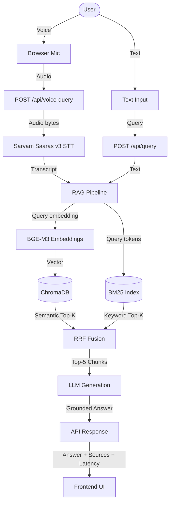

Visit:- https://voice-enabled-rag-model-kkfd.onrender.com/

---
title: HH-Goa Voice RAG
emoji: 🎙️
colorFrom: blue
colorTo: green
sdk: docker
app_port: 7860
---

# HH-Goa Voice RAG 🎙️📄


> A document-grounded, multi-modal (voice + text) conversational AI assistant for the HH-Goa housing scheme, featuring hybrid retrieval and multi-lingual speech-to-text.

## 🏗️ Architecture Overview.

The system uses a modern RAG (Retrieval-Augmented Generation) pipeline, enhanced with voice capabilities and hybrid search for superior document retrieval.



## 🛠️ Tech Stack

| Component | Technology | Purpose |
| --- | --- | --- |
| **Backend Framework** | FastAPI | High-performance async API server |
| **Vector Database** | ChromaDB | Persistent local semantic search |
| **Keyword Search** | BM25 (Rank-BM25) | Exact match and keyword retrieval |
| **Embeddings** | BGE-M3 (BAAI) | Multilingual semantic representations |
| **LLM Inference** | OpenAI API / Gemini | Text generation and reasoning |
| **Speech-to-Text** | Sarvam Saaras v3 | Indic language transcription |
| **Frontend** | HTML/JS/CSS | Responsive glassmorphic UI |

## 🚀 Quick Start

### 1. Installation

Requires Python 3.11+.

```bash
# Clone the repository
git clone https://github.com/yourusername/HH-Goa.git
cd HH-Goa

# Create virtual environment
python -m venv venv
source venv/bin/activate  # On Windows: venv\Scripts\activate

# Install dependencies
pip install -r requirements.txt
```

### 2. Environment Variables

Copy the example environment file and fill in your keys:

```bash
cp .env.example .env
```

| Variable | Description | Default / Example |
| --- | --- | --- |
| `LLM_API_KEY` | Your API key for the LLM provider | `sk-...` |
| `LLM_PROVIDER` | Provider for text generation | `openai` |
| `LLM_MODEL` | Specific model to use | `gpt-4o-mini` |
| `SARVAM_API_KEY` | Sarvam AI key for STT | `srvm-...` |
| `CHROMA_PERSIST_DIR` | Where vector data is stored | `./data/chroma` |

### 3. Data Ingestion

Before querying, you must ingest the scheme documents.

```bash
# Put your source text/PDF files in data/raw/
# Or use the test documents:
python -m ingestion.pipeline ./data/test/sample_documents
```

### 4. Run the Server

```bash
python run.py
```

The application will be available at:
- **Frontend UI**: http://localhost:8000
- **API Docs (Swagger)**: http://localhost:8000/docs

## 📚 API Documentation

### Health Check
```bash
curl http://localhost:8000/api/health
```

### Text Query
```bash
curl -X POST http://localhost:8000/api/query \
  -H "Content-Type: application/json" \
  -d '{"query": "What is the objective of the scheme?"}'
```

### Voice Query
```bash
curl -X POST http://localhost:8000/api/voice-query \
  -F "audio=@/path/to/recording.webm"
```

### Analytics
```bash
curl http://localhost:8000/api/metrics
```

## 🔍 Retrieval Architecture

This project implements a **Hybrid Search Pipeline**:
1. **Semantic Search**: Uses BGE-M3 embeddings and ChromaDB to find conceptually similar chunks, even if exact keywords differ. BGE-M3 was chosen for its excellent multilingual support (important for Goa's demographics).
2. **Keyword Search**: Uses BM25 to find exact matches for names, ID numbers, or specific scheme terminology.
3. **Reciprocal Rank Fusion (RRF)**: Merges the results from both strategies to get the best of both worlds.
   - Formula: `Score = 1 / (k + rank_bm25) + 1 / (k + rank_vector)`

## 🛡️ Guardrails & Safety

The system implements multiple layers of safety:
- **Input Sanitization**: Strips excessive whitespace and truncates overly long queries (>2000 chars).
- **Prompt Injection Detection**: Uses semantic similarity against a known blacklist of jailbreak attempts.
- **Relevance Checking**: Ensures retrieved chunks actually meet a minimum similarity threshold before passing to the LLM.
- **Grounded Generation**: The system prompt strictly restricts the LLM to *only* use provided context, outputting a standard refusal if the answer isn't in the docs.

## 📊 Latency & Analytics

Every request tracks granular latency metrics across the pipeline:
- `stt_ms`: Speech transcription time
- `embedding_ms`: Time to embed the query
- `bm25_ms`: Time for keyword search
- `vector_ms`: Time for ChromaDB search
- `rrf_ms`: Time to merge and rank results
- `llm_ms`: Time for final text generation
- `total_ms`: End-to-end wall time

You can view these directly in the UI under the "Performance" card.

## 🧪 Evaluation

To ensure quality and performance, use the provided evaluation scripts:

### Latency Benchmark
Runs simulated load against the live API to calculate P50/P70/P90 latencies.
```bash
python evaluation/benchmark.py --n 20
```

### Retrieval Evaluation
Tests Hit@K and Mean Reciprocal Rank (MRR) using a curated dataset of queries.
```bash
python evaluation/retrieval_eval.py
```

## 🎙️ Voice Interface

The frontend supports direct microphone recording using the browser's `MediaRecorder` API. 
1. Click the microphone button.
2. Accept the browser permission prompt.
3. Speak your question (supports English, Hindi, and Hinglish).
4. Click the button again to stop recording.
5. The audio is sent as a WebM Blob to the `/api/voice-query` endpoint.

## ⚠️ Known Limitations
- Vector database is local-only (ChromaDB); not currently configured for distributed scale.
- Voice queries are limited to 60 seconds.
- PDF parsing currently extracts raw text and may struggle with complex tables.

## 🔮 Future Improvements
- Add multimodal retrieval (images/charts from documents).
- Integrate conversation history (multi-turn RAG).
- Stream LLM responses via Server-Sent Events (SSE) for better perceived latency.
- Add user feedback mechanisms (thumbs up/down) for fine-tuning.

👥  Contributors

Keshav Gupta — Product, Development & Integration

Soham — Development & Contribution 

Money Goyal — Development & Contribution 


## 📄 License

MIT License. See `LICENSE` for details.
